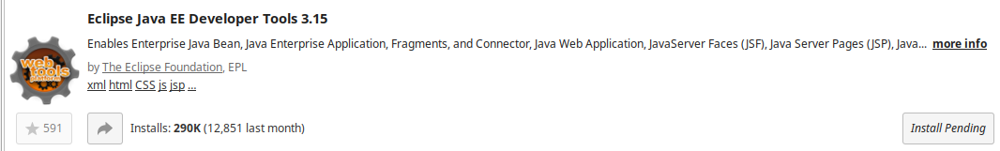

# Pre-requisite

## Remarkable (Optional)
https://remarkableapp.github.io/

## Apache tomcat
Download latest core tomcat version from https://tomcat.apache.org/

```
mkdir ~/TOOLS
# unpack tomcat  archive into ~/TOOLS
```

## Eclipse plugin


# Compile
Note that several web apps are deployed inside the same war.

```
# to use com.example.jersey.first
mv src/main/webapp/WEB-INF/web.xml.hello mv src/main/webapp/WEB-INF/web.xml

# to use com.example.jersey.jaxb
mv src/main/webapp/WEB-INF/web.xml.jaxb mv src/main/webapp/WEB-INF/web.xml

# to use com.example.jersey.todo
mv src/main/webapp/WEB-INF/web.xml.todo mv src/main/webapp/WEB-INF/web.xml
```

Then compile with
```
mvn package
```

# Run from command line
```
mv target/jersey-sample.war ~/TOOLS/apache-tomcat-9.0.29/webapps/jersey-sample.war
cd ~/TOOLS/apache-tomcat-9.0.29/
bin/startup.sh # start tomcat
ps aux | grep tomcat # check tomcat process
netstat -tulpn | grep <pid> # list opened port for process identified by <pid>
```

# Run from within eclipse
Install apache tomcat adapter


Select right adapter


Select right tomcat installation folder


Right click on the project:


Create a new server if needed:


# Use
Please visit: `http://localhost:8080/jersey-sample`
